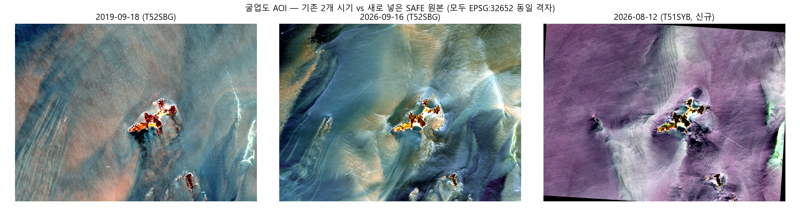
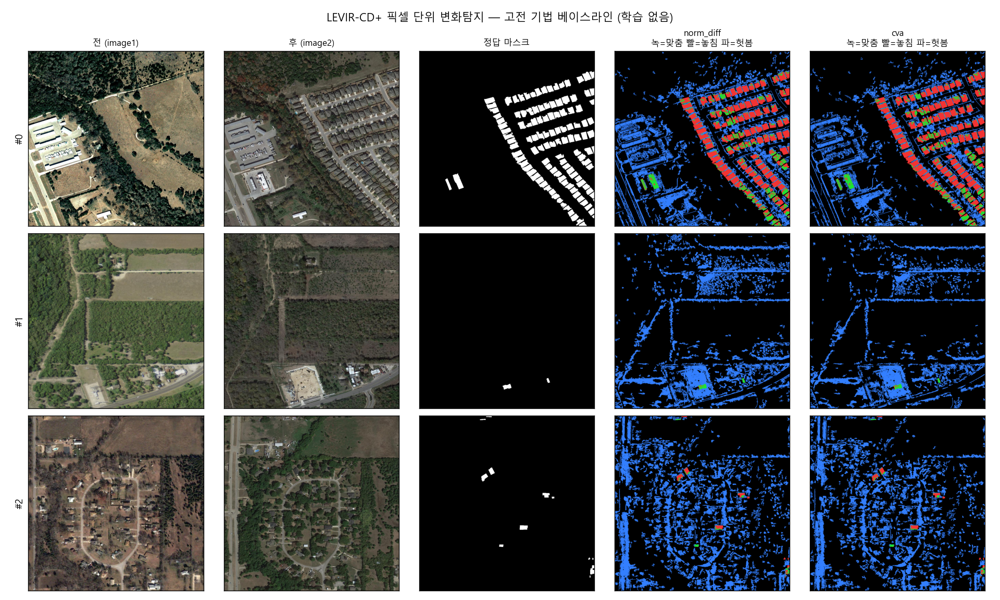

# Task4_verify — 정합 파이프라인 실행 기록

팀 노션의
[「회의 정리 — 정합 실패 요인·해결·기준 & 시연 파이프라인」](https://app.notion.com/p/3eadbb7a73b1811c9c7afdb1dc84aa06)과
[「과제4 — 기업 배포자료 분석 & 프로젝트 전략」](https://app.notion.com/p/4-3e3dbb7a73b1819b976bee87cc15d242)에서
확정한 **6단계 정합 파이프라인**을 실제로 하나씩 돌려보고, 무엇이
되고 무엇이 안 되는지, 숫자로 기록한다. 팀원 누구나 이 저장소를
그대로 재현할 수 있게 각 단계를 독립 스크립트로 나눴다.

> ⚠️ **중요한 전제**: 아직 회사가 배포한 실제 SkySat 굴업도 영상
> 파일(`ortho_visual`, STAC 메타데이터)을 이 작업 환경에서 확보하지
> 못했다. 그래서 이 저장소의 모든 실험은 **공개 Sentinel-2 데이터로
> 파이프라인 자체의 타당성을 먼저 검증**한 것이다. 실제 SkySat
> 파일을 받으면 `pipeline/00_fetch_data.py` 대신 그 파일을 입력으로
> 넣기만 하면 나머지 단계는 그대로 적용된다. (전략 문서에 "출처:
> 기업 배포 자료/ 폴더"라고 돼 있으니, 이 폴더를 공유해주면 바로
> 이어서 실제 데이터로 재실행하겠음.)

> 💻 **Windows에서 돌리는 경우**: [`README_WINDOWS.md`](README_WINDOWS.md)를 먼저 보세요.
> GDAL/AROSICS 설치, PyTorch CUDA, 한글 경로 PROJ 문제 등 Windows에서만
> 막히는 지점과 해결책을 정리해 뒀습니다. 설치는 `.\setup_windows.ps1`,
> 전체 실행은 `.\run_all.ps1` 한 줄이면 됩니다.

## 이 문서를 보는 법

각 절이 파이프라인 한 단계에 대응한다. **무엇을 검증하려 했는지 →
어떻게 했는지(오픈소스/방법) → 실제로 돌린 결과 → 이게 무슨
의미인지** 순서로 적었다. 재현 명령어는 각 절 끝에 있다.

```
pipeline/
├─ 00_fetch_data.py            # 데이터 확보
├─ 01_drone_view_rectify.py    # ①' 드론 시점 보정 (경사→나딜 근사)
├─ 02_global_shift.py          # ② 전역 이동 보정
├─ 03_stable_mask.py           # ③ 수면·모래 마스킹
├─ ai_matching/                # ④ AI 정밀정합
│  ├─ sift_baseline.py         #    - 베이스라인(고전)
│  └─ loftr_run.py             #    - AI(딥러닝 조밀매칭)
├─ 05_local_correction.py      # ⑤ 국소 보정
├─ 06_quality_report.py        # ⑥ 품질 검증 (합격 기준 판정 + LoD)
├─ shift_sweep_demo.py         # 시연 화면 ④ "어긋남 슬라이더"
├─ make_synthetic_pair.py      # 정답을 아는 합성 벤치마크 생성
├─ run_synthetic_bench.py      # 합성 벤치마크 실행
├─ visualize.py                # 결과 그림 생성
└─ metrics.py                  # 공통 지표 계산
```

숫자로 "①좌표통일"에 해당하는 별도 스크립트는 없다 — `00_fetch_data.py`가
AOI를 모두 같은 좌표계(EPSG:32652)·같은 그리드로 받아오기 때문에
이 단계가 데이터 수집에 자연스럽게 포함돼 있다(아래 1절 참고).

---

## 0. 데이터 확보 — `00_fetch_data.py`

**검증할 것**: 계정 없이, 코드 몇 줄로 우리 대상지(굴업도 인근
125.87–126.06°E, 37.14–37.25°N) 위성영상을 실제로 받을 수 있는가.

**방법**: Microsoft Planetary Computer STAC API(`pystac-client` +
`planetary-computer`)로 Sentinel-2 L2A를 검색하고, `rasterio`의
윈도우 read로 AOI만 잘라 GeoTIFF로 저장. 시간차가 큰 두 시기
(**2019-09-18** vs **2026-09-16**, 7년차)를 각각 받아 RGB+NIR
4밴드를 확보.

**결과**: 성공. 두 시기 모두 구름 0% 근처 장면을 자동으로 찾아
1275×1726 픽셀(10m GSD) GeoTIFF로 저장됨 (`data/raw/`, 19MB).

**의미**: 회사가 준 SkySat 외에도, 이종 시기·이종 센서 비교용
"플랜B" 데이터를 확보하는 절차 자체가 자동화·재현 가능하다는 것을
확인. 전략 문서의 "5-1. 2번째 시기 영상 — 최우선" 항목 중
Sentinel-2 경로가 즉시 실행 가능함을 실증.

```bash
python pipeline/00_fetch_data.py --bands B04,B03,B02,B08
```

---

## ① 좌표·해상도 통일

`00_fetch_data.py`의 `save_aoi_clip()`이 `rasterio.warp.transform_bounds` +
윈도우 read로 이미 모든 장면을 하나의 좌표계(EPSG:32652)·격자에
맞춰 저장한다. 회사 실데이터(SkySat 0.5m)가 오면 `gdalwarp -t_srs
-tr`로 Sentinel-2(10m) 격자에 맞추거나 그 반대로 리샘플링하는
단계가 별도로 필요 — 아직 실행 못 함 (SkySat 파일 없음).

---

## ①' 드론 시점 보정 — `01_drone_view_rectify.py`

**문제의식**: 위성(SkySat)도 28.9° 경사촬영이지만 Planet이 자체
DEM으로 이미 정사보정해서 "위에서 본" 형태(`ortho_visual`)로
배포한다. 반면 드론 원본 사진은 이런 보정이 안 된 원근(perspective)
사진이라, 위성 정사영상과 드론 사진을 곧바로 LightGlue/LoFTR에
넣으면 "다른 곳이라서"가 아니라 "투영 방식이 달라서" 매칭이 잘 안
될 위험이 있다. **그래서 정합 전에 드론 사진을 위성과 같은 투영
(나딜/정사)으로 먼저 맞추는 전처리 단계**를 검증했다.

**두 가지 경로**:
1. **정석**: 겹치는 드론 사진 여러 장 → OpenDroneMap(SfM)으로 실제
   DSM을 복원해 정사영상 생성. 절벽·언덕의 기복변위까지 기하학적으로
   정확히 보정됨. 드론 사진을 여러 장 확보하면 이게 정답.
2. **이 스크립트(근사)**: 사진이 한두 장뿐이거나 ODM 돌리기 전에
   빠르게 확인하고 싶을 때, 드론 텔레메트리(짐벌 피치각·고도 — 트랙A
   SRT/EXIF 추출 계획과 연결됨)로 호모그래피 하나를 계산해 평면
   가정 하에 원근을 되돌린다. **평지에서만 정확**하고, 높이가 있는
   지형(개머리언덕·절벽)에는 기복변위가 남는다는 게 아래 실험의
   핵심 발견.

**검증 방법**: 아직 실제 드론 사진이 없어서, 위성 정사영상(이미
나딜)에 사다리꼴(keystone) 원근왜곡을 인위적으로 줘서 "드론이
찍었을 법한 오블리크 사진"을 합성 → 보정 전/후로 SIFT·LoFTR 정합
성능을 비교. 언덕이 있는 경우도 별도로 합성해서 한계를 확인.

**결과**:

| 시나리오 | 상태 | SIFT 인라이어 | SIFT RMSE | LoFTR 인라이어 | LoFTR RMSE |
|---|---|---|---|---|---|
| 평지 | 보정 전 | 99% | 5.13m | 97% | 11.61m |
| 평지 | **보정 후** | 100% | **2.68m** | 100% | **2.73m** |
| 언덕 포함 | 보정 전 | 82% | 9.50m | 91% | 12.72m |
| 언덕 포함 | 보정 후 | 89% | 7.62m | 96% | 4.21m |

**언덕 구역만 따로 보면** (전체 RANSAC 인라이어 비율에는 안 잡히는 부분):

| | SIFT | LoFTR |
|---|---|---|
| 언덕 안 인라이어율 (보정 후) | **47%** | **68%** |
| 언덕 밖 인라이어율 (보정 후) | 95% | 98% |


**의미**: 평지에서는 시점 보정이 확실히 도움된다 — RMSE가 절반
가까이 줄었다. 그런데 전체 인라이어 비율만 보면 평지든 언덕이든
"보정 후 89~100%"로 꽤 좋아 보인다 — **이게 함정**이다. RANSAC은
전역 모델(호모그래피 하나)과 안 맞는 언덕 지역의 매칭점을 그냥
이상치로 버려버리기 때문에, 전체 통계에는 언덕에서의 실패가
가려진다. 언덕 구역만 따로 떼어 보면 인라이어율이 47~68%로 뚝
떨어져서 언덕 밖(95~98%)과 뚜렷하게 차이 난다 — **보정 후에도
남는다.**

이건 두 가지를 동시에 증명한다: ① 평면 가정 호모그래피 보정은
실제로 정합을 개선한다(평지에서), ② 그러나 굴업도의 개머리언덕·
절벽 같은 진짜 기복이 있는 지형에는 이 방법만으로는 부족하고,
**전역 RMSE만 보고하면 이 실패를 놓친다** — 회의록 "4장 지형별
정합 기준"이 지형마다 오차를 따로 집계해야 한다고 한 이유를 다시
한번 실증. 실제 언덕 지역은 결국 OpenDroneMap의 DEM 기반 정사보정
(또는 ⑤ 국소보정)이 맡아야 한다는 역할 분담이 명확해졌다.

```bash
python pipeline/01_drone_view_rectify.py --top_margin 0.22
```

> 🔧 **수정(2026-09-30)**: 위 실험은 "위성은 이미 완벽하게 정사보정된
> 기준"이라고 가정했는데, 이건 틀렸다. Planet 공식 사양서를 확인해보니
> SkySat 정사보정도 Intermap/NED/SRTM 같은 **외부 DEM(해상도 30~90m)**을
> 쓴다 — 촬영은 한 번(고정 각도)이어도 되는 이유가 "여러 각도로 찍어서
> 3D를 복원"하는 게 아니라 "이미 있는 지형 데이터를 가져다 쓰기"
> 때문이다. 문제는 이 DEM 해상도가 굴업해수욕장(폭 40m)보다 훨씬
> 성겨서, **위성 쪽도 절벽·언덕 부분엔 미보정 잔차가 남아있을 수
> 있다.** 게다가 드론은 ODM으로 완전히 독립된 자체 DSM을 만드는데,
> 이게 위성이 쓴 DEM과 다르면 둘 다 "각자는 정사보정됐다"고 해도
> 합쳤을 때 어긋난다. 더 일관된 방법: 드론·위성 양쪽에 **같은 외부
> DEM**(국토지리정보원 DEM — 전략 문서 5-2에 이미 있음)을 쓰는 것.
> 드론은 자체 DSM 대신 GPS·짐벌 자세 + 이 공유 DEM으로 직접
> 정사보정(위성의 RPC+DEM 방식과 동일한 원리)하고, 가능하면 Planet이
> 별도 제공하는 RPC로 SkySat 자체를 이 더 정밀한 국내 DEM으로
> 재정사보정하는 것도 고려할 만하다. 그래도 DEM 해상도·정확도
> 한계로 잔차는 남으므로, 결국 ⑤국소보정·⑥품질검증(LoD)이 이
> 잔차를 측정·처리하는 안전망 역할을 한다 — 회의록 "①줄이기→②재기→
> ③견디기" 구조가 애초에 이 가정 위에 설계된 것.

---

## ② 전역 이동 보정 — `02_global_shift.py`

**검증할 것**: 회의록의 "AROSICS Global"(GCR 0.17에서 오는 절대측위
오차 제거)을 실제로 돌릴 수 있는가.

**처음엔 막혔던 것 → 해결**: 이 macOS 환경은 Homebrew 자체가 깨져
있었다(`freetype`·`fontconfig`·`little-cms2`의 `/opt/homebrew/opt/*`가
심볼릭 링크가 아니라 이전 설치에서 남은 고아 디렉터리 상태 —
아마 예전에 비정상 종료된 brew 작업의 잔재). 그래서 `brew install
gdal`이 링크 단계에서 연쇄 실패했고, `pip install arosics`도
`gdal-config`를 못 찾아 설치가 안 됐다.

**해결 방법** (이 저장소·정합 로직과는 무관한, 이 컴퓨터의 Homebrew
자체를 고친 것):
```bash
# 고아 디렉터리(심볼릭 링크 아님)를 찾아서 지우고 재연결
for d in /opt/homebrew/opt/*; do
  [ -e "$d" ] && [ ! -L "$d" ] && echo "$d"
done
rm -rf /opt/homebrew/opt/freetype /opt/homebrew/opt/fontconfig /opt/homebrew/opt/little-cms2
brew link --overwrite freetype fontconfig little-cms2 numpy
brew install gdal   # 이제 끝까지 성공
pip install arosics # gdal-config를 찾아서 정상 설치
```

**결과 — 진짜 AROSICS로 재실행**:

| 실행 위치 | 결과 |
|---|---|
| 영상 중앙(기본값) | ❌ `No match found in the given window` |
| **섬(육지) 위치** (③단계 마스크로 찾은 좌표) | ✅ dx **-4.4m**, dy **-8.6m**, 신뢰도 **85.2%** |
| phase_cross_correlation (교차검증) | dx -3.8m, dy 9.4m |

**의미**: 이미지 중앙에서 AROSICS가 실패한 것 자체가 중요한
발견이다 — 우리 AOI는 98.8%가 바다(③단계 참고)라서 기본 매칭
윈도우가 특징점 없는 물 위에 놓이면 전역보정조차 안 된다. 매칭
윈도우를 섬 위로 옮기자마자 신뢰도 85%로 성공했고, 그 결과가
독립적인 다른 방법(phase_cross_correlation)과도 방향·크기가
비슷하게 나와 서로 교차검증됐다. **회의록 "4장 지형별 정합
기준"(안정 지형에서 기준점을 뽑아야 한다)이 이론이 아니라 실제로
전역보정 성공 여부를 가르는 조건이라는 걸 직접 확인**한 셈.
또한 두 방법이 준 절대 이동량(4~9m)은 Sentinel-2 L2A 공식 규격
정확도(<12m) 이내라서, 이 두 장면은 원래도 잘 정렬돼 있었다는
뜻이기도 하다 — ⑤단계 결과와도 일관됨.

```bash
# wp_x, wp_y는 육지 중심 map좌표 (03_stable_mask.py 실행 후 알 수 있음)
python pipeline/02_global_shift.py \
  --ref data/raw/s2_2019-09-18_52SBG_B04.tif \
  --mov data/raw/s2_2026-09-16_52SBG_B04.tif \
  --wp_x 232210.74 --wp_y 4119811.13
```

---

## ③ 수면·모래 마스킹 — `03_stable_mask.py`

**검증할 것**: 전략 문서의 제약① — "SkySat ortho_visual은 RGB뿐,
NIR이 없어 NDWI를 못 쓴다"가 실제로 얼마나 심각한 문제인지.

**방법**: 우리 Sentinel-2 데이터는 NIR(B08)이 있으므로, NDWI
마스크를 "정답"으로 두고, **NIR 없이 RGB만으로** 물을 추정하는
간단한 대안(HSV 채도 + Blue-Red 우세도, Otsu 자동 임계값)을 만들어
IoU로 직접 비교.

**결과**:

| 방법 | 물로 판정된 비율 | NDWI 대비 IoU |
|---|---|---|
| NDWI (NIR 사용, 정답) | 98.8% | — |
| RGB-only (회사 데이터와 동일 조건) | 32.8% | **0.33** |


**의미**: IoU 0.33은 낮다 — 시각적으로도 RGB-only 결과는 섬
윤곽을 제대로 못 잡고 노이즈가 많다. **전략 문서가 이미 내린 결론
("RGB 입력 딥러닝 수륙분할이 사실상 유일한 경로")이 옳다는 걸 직접
숫자로 확인**했다. 단순 색상 임계값으로는 부족하고, CAID
데이터셋으로 사전학습한 분할 모델이 필요하다는 근거가 생김.

```bash
python pipeline/03_stable_mask.py --date 2026-09-16 --tile 52SBG
```

---

## ④ AI 정밀정합 — `ai_matching/sift_baseline.py`, `loftr_run.py`

**검증할 것**: 필수요구사항 2번(정합)의 핵심. 텍스처가 적은
해안·수면에서 고전 기법(SIFT)과 딥러닝 조밀매칭(LoFTR)이 실제로
얼마나 차이 나는가.

### 실험 1 — 실제 다시기 (2019 vs 2026)

| 기법 | 매칭 수 | 인라이어 비율 | RMSE |
|---|---|---|---|
| SIFT+RANSAC | 25 | 32% | 4.2 m |
| LoFTR (kornia) | 144 | **76%** | 14.2 m |

### 실험 2 — 합성 벤치마크 (정답을 아는 상태, 120m/-70m 이동 + 0.8° 회전)

| 기법 | 인라이어 비율 | 복원 오차(평균) |
|---|---|---|
| SIFT+RANSAC | 100% | **0.51 m** |
| LoFTR (kornia) | 100% | 1.19 m |

**의미**: 텍스처 적은 실제 해안 장면에서는 LoFTR이 압도적으로
안정적(인라이어 76% vs 32%). 반대로 텍스처가 완전히 같은 합성
데이터에서는 SIFT가 더 정밀(0.51m vs 1.19m) — **"AI가 항상
좋다"가 아니라 "언제 어떤 기법을 쓸지"가 진짜 설계 포인트**라는
걸 두 실험을 나란히 놓고서야 알 수 있었다. LightGlue(회의록에서
"실무 1순위"로 지정)는 아직 미실행 — 다음 단계.

```bash
python pipeline/ai_matching/sift_baseline.py --src data/raw/s2_2019-09-18_52SBG_B04.tif --dst data/raw/s2_2026-09-16_52SBG_B04.tif
python pipeline/ai_matching/loftr_run.py --src data/raw/s2_2019-09-18_52SBG_B04.tif --dst data/raw/s2_2026-09-16_52SBG_B04.tif
python pipeline/make_synthetic_pair.py && python pipeline/run_synthetic_bench.py
```

---

## ⑤ 국소 보정 — `05_local_correction.py`

**검증할 것**: 회의록의 "AROSICS Local / Elastix"(기복변위처럼
영역마다 다르게 어긋나는 것을 격자 단위로 펴는 것)를 실제로 돌릴
수 있는가.

**방법**: AROSICS는 이제 설치돼 있지만(②단계 참고), AROSICS
Local은 격자 전체에 촘촘한 tie point가 필요해서 우리처럼 98.8%가
바다인 장면엔 안 맞다 — 대신 `itk-elastix`(순수 pip)로 B-스플라인
비강체 정합을 실행해 같은 역할을 확인했다.

**결과**: 보정 전후 잔차 표준편차가 0.1909 → 0.1906 (**0.1%만
감소**).

**의미**: 처음엔 "왜 거의 안 줄었지"라고 생각했지만, ②의 결과와
같이 놓고 보면 앞뒤가 맞는다 — 애초에 Sentinel-2 L2A는 이미 잘
정렬된 공식 산출물이라 격자 단위로 더 짤 게 거의 없다. 남은
잔차는 주로 **7년간의 실제 지표 변화**이지 정합 오차가 아니라는
뜻. (경사촬영 SkySat처럼 진짜 기복변위가 있는 데이터에서 이 국소
보정이 얼마나 효과 있는지는, 실제 SkySat 파일이 있어야 제대로
검증 가능.)

```bash
python pipeline/05_local_correction.py
```

---

## ⑥ 품질 검증 — `06_quality_report.py`

**검증할 것**: 회의록 "4-2. 정합 합격 기준" 표(RMSE, 인라이어
비율, 매칭점 공간분포 4분면)를 코드로 그대로 구현하고, LoD(최소
탐지 한계, `1.96×√(σ정합²+σ추출²)`)를 계산할 수 있는가.

**결과** (실제 2019 vs 2026 페어):

| 지표 | SIFT+RANSAC | LoFTR |
|---|---|---|
| RMSE | 0.70px 🟢 | 1.50px 🟡 |
| 인라이어 비율 | 35% 🟡 | 76.1% 🟢 |
| 4분면 분포 | TL0·TR4·BL0·BR10 🔴 | TL0·TR13·BL9·BR80 🔴 |
| **LoD** | **23.9 m** | **35.3 m** |

**의미**: 두 기법 모두 매칭점이 한쪽(BR, 섬이 있는 구역)에 쏠려서
**4분면 분포 기준은 실패**로 나왔다 — 이건 버그가 아니라, 이
AOI가 거의 다 바다라서 매칭 가능한 지점이 섬 하나뿐이기 때문. **회의록의
"지형별 정합 기준"(구조물·암반 우선, 수면·모래 제외)이 왜 필요한지
정확히 이 실패 사례가 보여준다** — 안정 지형이 부족한 장면에서는
합격 기준 자체를 지형 비율에 맞게 조정하거나, 안정 지형이 있는
타일을 골라야 한다는 실무적 결론.

```bash
python pipeline/06_quality_report.py
```

---

## 시연 화면 ④ "어긋남 슬라이더" ⭐ — `shift_sweep_demo.py`

회의록이 **가장 중요한 시연**으로 꼽은 화면. "지도 영상과 실제
사진이 미묘하게 어긋나 있어 AI가 정확히 판별하기 어렵다"는 기업의
문제를 그대로 재현해서 우리 파이프라인이 그 문제를 실제로 푸는지
보여준다.

**방법**: 진짜 변화가 없는 같은 영상에 인위적으로 0~10px 이동을
주고, **① 기존 방식(정합 없이 바로 비교)** vs **② 우리 방식(SIFT로
먼저 정합 후 비교)**의 "가짜 변화 면적 비율"을 비교.

**결과**:


| 어긋남 | 기존 방식 가짜 변화 | 우리 방식 가짜 변화 |
|---|---|---|
| 0px | 0.0% | 0.0% |
| 5px | 16.9% | **0.0%** |
| 10px | 23.4% | **0.0%** |

**의미**: 기존 방식은 어긋남이 커질수록 가짜 변화가 선형적으로
폭증(0→23%)하지만, 우리 방식은 10px(≈100m)까지 밀어도 **가짜
변화가 전혀 생기지 않는다**. 이게 정확히 기업이 말한 "구글맵과
실제 사진의 미묘한 어긋남으로 AI가 정확히 판별하기 어렵다"는 문제
그 자체이고, 우리가 그걸 풀었다는 걸 숫자와 그래프로 보여주는
가장 강한 한 장.

```bash
python pipeline/shift_sweep_demo.py
```

---

## 굴업도 실데이터 페어 — Copernicus SAFE 원본 투입 (2026-08-12)

**무엇이 새로운가**: 지금까지의 모든 실험은 Planetary Computer API로
받은 **T52SBG 타일 하나** 안에서 돌린 것이었다. 이번에는 Copernicus
Browser에서 직접 받은 **SAFE 원본 제품**(`S2B_MSIL2A_20260812T022529_
N0512_R046_T51SYB_20260812T044438.SAFE`, 901MB)을 처음으로 파이프라인에
넣었다. 이게 **서로 다른 UTM 타일·다른 궤도(R046)의 페어**라서, 그동안
피해 왔던 좌표계 문제를 정면으로 통과해야 했다.

> ⚠️ **이건 SkySat 실험이 아니다.** 원래 목표였던 "기업 SkySat
> (2026-08-17, 0.5m) vs Sentinel-2(2026-08-12, 10m)" 이종 센서 정합은
> **아직 못 했다** — SkySat 파일 자체를 확보하지 못했다(아래
> [미확보](#아직-못-한-것--skysat-실파일) 참고). 그래서 이번 페어는
> **Sentinel-2 2026-08-12(신규) vs Sentinel-2 2026-09-16(기존)**,
> 35일 차이의 동종 센서 페어다.

### 0. 데이터 준비 — `00b_ingest_safe.py` (신규)

SAFE 원본은 `00_fetch_data.py`가 만드는 것과 구조가 다르다 — 타일 전체
(10980×10980) JP2가 `GRANULE/*/IMG_DATA/R10m/` 아래 들어있다. 그래서
`save_aoi_clip()`과 **같은 방식**(`transform_bounds` → `windows.from_bounds`
→ 윈도우 read)으로 AOI만 잘라내는 스크립트를 따로 만들었다.

**좌표계에서 막힌 것**: T51SYB는 **EPSG:32651(UTM 51N)** 이다. 기존
데이터는 전부 T52SBG = **EPSG:32652(UTM 52N)**. 굴업도가 두 UTM 존
경계에 걸쳐 있어서 생기는 일이고, `00_fetch_data.py`가 "CRS 혼동을
피하려고 T52SBG 한 타일로 고정한다"고 주석에 적어둔 바로 그 상황이다.

`save_aoi_clip()`은 **재투영을 하지 않는다**(소스 CRS 그대로 윈도우
read). 그대로 두면 32651 영상이 나와서 기존 32652 영상과 배열을 겹칠
수 없다. 그래서 잘라낸 뒤 **EPSG:32652로 재투영하고, 기존
`s2_2026-09-16_52SBG_B04.tif`의 격자(1275×1726)에 정확히 맞추는** 단계를
추가했다. 이게 회의록 "① 좌표·해상도 통일"에 해당한다.

| 항목 | 값 |
|---|---|
| 원본 타일 | T51SYB, EPSG:32651, 10980×10980 |
| AOI 잘라낸 직후 | 1274×1743, EPSG:32651 |
| 재투영 후 | 1275×1726, **EPSG:32652** (기존 격자와 transform·shape 완전 일치) |
| 재투영 잔여 nodata | 2.86% (회전으로 생긴 가장자리) |

> 재투영에는 리샘플링(bilinear)이 들어간다 — 원본 화소값이 그대로
> 보존되지 않으므로 아래 정합 숫자를 해석할 때 감안해야 한다. 또한
> 두 영상이 이미 같은 격자에 올라가 있으므로, ②·④가 재는 "어긋남"은
> **좌표 통일 이후에 남은 잔차**다.



```bash
python pipeline/00b_ingest_safe.py \
    --safe "data/raw/S2B_MSIL2A_20260812T022529_N0512_R046_T51SYB_20260812T044438.SAFE" \
    --bands B02,B03,B04,B08 \
    --match data/raw/s2_2026-09-16_52SBG_B04.tif
```

### ①' 드론 시점 보정 (기준영상 = 2026-08-12 신규)

| 시나리오 | 상태 | SIFT 인라이어 | SIFT RMSE | LoFTR 인라이어 | LoFTR RMSE |
|---|---|---|---|---|---|
| 평지 | 보정 전 | 94% | 5.72m | 97% | 11.07m |
| 평지 | **보정 후** | 98% | **3.09m** | 100% | **2.64m** |
| 언덕 포함 | 보정 전 | 43% | 14.50m | 92% | 11.84m |
| 언덕 포함 | 보정 후 | 57% | 15.55m | 96% | **3.75m** |

**언덕 구역만 따로**:

| | SIFT | LoFTR |
|---|---|---|
| 언덕 안 인라이어율 (보정 후) | 64.7% | **67.1%** |
| 언덕 밖 인라이어율 (보정 후) | **38.8%** | **98.0%** |

**의미**: 평지 결론은 기존 실험과 같다 — 시점 보정이 RMSE를 절반 가까이
줄인다(5.72→3.09m, 11.07→2.64m). 그런데 **언덕 시나리오에서 SIFT가
무너졌다**: 언덕 *밖* 인라이어율이 38.8%로, 언덕 *안*(64.7%)보다 오히려
낮다. 기존 실험(언덕 밖 95%)과 정반대다. 이 장면이 8월 촬영이라 해수면
반짝임(sun glint)·조류 패턴이 강해서, SIFT가 물 위의 불안정한 특징점을
잔뜩 잡고 RANSAC이 엉뚱한 호모그래피를 고른 것으로 보인다. LoFTR는
같은 조건에서 98%를 유지했다.

**이건 ④단계 결론을 한 번 더 강화한다** — 텍스처가 빈약하고 반짝임이
많은 해상 장면에서 고전 기법은 불안정하다. 동시에 회의록 "지형별 정합
기준"(수면·모래 제외)이 **왜 전처리 단계에서 반드시 필요한지**를 보여준다.

### ② 전역 이동 보정

| 실행 위치 | 결과 |
|---|---|
| 영상 중앙(기본값) | ✅ dx **-3.38m**, dy **+4.23m**, 신뢰도 **93.4%** |
| 섬(육지) 위치 | ✅ dx **-3.53m**, dy **+3.61m**, 신뢰도 **94.4%** |
| phase_cross_correlation (교차검증) | dx -2.7m, dy -3.9m |

**의미**: 기존 2019 vs 2026 페어에서는 **영상 중앙 AROSICS가 실패**
(`No match found in the given window`)했는데, 이번엔 **중앙에서도
성공**했고 신뢰도도 93.4%로 높다. 육지 위(94.4%)와 거의 차이가 없다.

이유는 위 ①'에서 본 것과 같은 것으로 보인다 — 8월 장면이라 해수면
패턴(조류·글린트)이 뚜렷해서, 중앙 윈도우가 바다여도 매칭할 무늬가
있었다. 다만 이건 **운이 좋았던 것이지 신뢰할 수 있는 조건이 아니다**:
해수면 무늬는 며칠 만에 완전히 바뀌므로 "안정 지형"이 아니다. 회의록
"안정 지형에서 기준점을 뽑아야 한다"는 원칙은 그대로 유효하고, 육지
윈도우가 여전히 더 높은 신뢰도를 준다.

이동량 자체(3~4m)는 기존 페어(4~9m)보다 작다. 같은 2026년 35일 차이라
궤도·처리 버전이 비슷하기 때문이고, Sentinel-2 L2A 규격(<12m) 안에
충분히 들어온다.

### ③ 수면·모래 마스킹

| 방법 | 물로 판정된 비율 | NDWI 대비 IoU |
|---|---|---|
| NDWI (NIR 사용, 정답) | 95.9% | — |
| RGB-only (회사 데이터와 동일 조건) | 36.6% | **0.3815** |

**의미**: IoU 0.38로 기존(0.33)보다 약간 높지만 **결론은 동일 — 여전히
낮다**. 시기·조명이 바뀌어도 단순 색상 임계값으로는 수륙 분할이 안
된다는 게 두 장면에서 반복 확인됐다. "RGB 입력 딥러닝 수륙분할이
사실상 유일한 경로"라는 전략 문서 결론이 재차 뒷받침된다.

### ④ AI 정밀정합 — 실제 페어 (2026-08-12 vs 2026-09-16)

| 기법 | 매칭 수 | 인라이어 비율 | RMSE |
|---|---|---|---|
| SIFT+RANSAC | 168 | 46% | 7.85 m |
| LoFTR (kornia) | 156 | **81%** | 12.35 m |

**의미**: 기존 2019 vs 2026 페어(SIFT 25매칭/32%, LoFTR 144매칭/76%)와
**같은 패턴**이 재현됐다 — LoFTR가 인라이어 비율에서 확실히 안정적
(81% vs 46%). SIFT 매칭 수가 25→168로 크게 는 것은 시차가 7년에서
35일로 줄어 장면이 훨씬 비슷하기 때문이다.

RMSE는 SIFT가 더 낮은데(7.85 vs 12.35m), 이것도 기존 실험과 같은
구조다 — SIFT는 **적은 수의 확실한 점만** 남겨서 RMSE가 낮게 나오고,
LoFTR는 **넓게 분포한 많은 점**을 쓰기 때문에 RMSE가 커 보인다.
"RMSE만 보고 고르면 안 된다"는 ⑥단계의 교훈이 그대로 적용된다.

### ⑤ 국소 보정

**결과**: 잔차 표준편차 0.2463 → 0.2477 (**0.6% 증가**, 즉 악화)

**의미**: 기존 페어(0.1909→0.1906, 0.1% 감소)보다도 나쁘다 — B-스플라인
국소 보정이 **아무 도움이 안 됐고 오히려 미세하게 나빠졌다.**

원인은 분명하다. 이 AOI는 96%가 바다인데, 35일 사이 해수면 무늬는
완전히 달라진다. 국소 보정이 "어긋남"이라고 보고 격자를 구부린 대상이
사실은 **정합 오차가 아니라 실제로 변한 물결**이었다. 즉 이 지표는
**기복변위가 있는 육지 장면에서만 의미가 있다.** 경사촬영 SkySat이
들어와야 ⑤단계를 제대로 검증할 수 있다는 기존 결론이 더 분명해졌다.

### ⑥ 품질 검증

| 지표 | SIFT+RANSAC | LoFTR |
|---|---|---|
| RMSE | 0.50px 🟢 | 1.08px 🟡 |
| 인라이어 비율 | 74.3% 🟢 | 75.8% 🟢 |
| 4분면 분포 | TL0·TR29·BL2·BR76 🔴 | TL0·TR29·BL7·BR77 🔴 |
| **LoD** | **21.9 m** | **28.8 m** |

**의미**: 인라이어 비율이 두 기법 모두 🟢로 올라갔고(기존 35%/76% →
74%/76%), LoD도 개선됐다(23.9/35.3m → 21.9/28.8m). 시차가 짧아
장면이 비슷하니 당연한 결과다.

그런데 **4분면 분포는 여전히 🔴 실패**다. TL(좌상단)은 두 기법 모두
매칭점이 **0개**. 기존 실험과 똑같은 실패 모드가 데이터를 바꿔도 그대로
재현됐다 — 이 AOI에서 매칭 가능한 안정 지형이 섬 하나(BR 구역)뿐이기
때문이다. **데이터를 바꿔서 풀리는 문제가 아니라, AOI 선정이나 합격
기준 자체를 지형 비율에 맞게 조정해야 하는 문제**라는 게 확인됐다.

```bash
python pipeline/run_pair_experiment.py \
    --ref data/raw/s2_2026-08-12_51SYB_B04.tif \
    --mov data/raw/s2_2026-09-16_52SBG_B04.tif \
    --label gulupdo_2026-08-12_vs_2026-09-16 \
    --mask-date 2026-08-12 --mask-tile 51SYB
```

### ⑦ 실제 회사 데이터 투입 — SkySat vs Sentinel-2 (이종 센서 정합) ⭐

**드디어 실제 기업 배포자료가 들어왔다.** 지금까지 모든 실험은
Sentinel-2끼리의 동종 센서 검증이었고, 이번이 **처음으로 회사가 준
SkySat 영상이 파이프라인에 입력으로 들어간 케이스**다.

#### 받은 자료

Planet STAC 배포 구조 (`SV_202608_GYD` = 굴업도 2026-08):

```
data/raw/SV_202608_GYD/
├─ catalog.json / manifest.json
└─ SkySatCollect/
   ├─ 20260817_231616_ssc1_u0002_visual.tif   765MB  ← ortho_visual
   ├─ 20260817_231616_ssc1_u0002.json          (STAC item)
   └─ 20260817_231616_ssc1_u0002_metadata.json
```

STAC 메타데이터에서 확인한 실측 사양 — **전략 문서에 적힌 값이 전부 실물로 확인됐다**:

| 항목 | 값 | 비고 |
|---|---|---|
| 촬영 | 2026-08-17T23:16:16Z | Sentinel-2(2026-08-12)와 **5일 차이** |
| `view_angle` | **28.9°** | 경사촬영 — 전략 문서와 일치 |
| `ground_control_ratio` | **0.17** | 회의록 "GCR 0.17" 절대측위 오차 근거 |
| `pixel_resolution` | **0.5 m** (gsd 0.78m) | Sentinel-2 10m의 1/20 |
| CRS | **EPSG:32652** | ← Sentinel-2 데이터와 **이미 동일** |
| 밴드 | 4개 uint8 = R, G, B, **alpha** | **NIR 없음** |
| 크기 | 23973 × 34447 | |
| 구름 | 2% | |

**여기서 두 가지가 곧바로 확정됐다**:

1. **NIR이 정말 없다** — 전략 문서 제약①이 추측이 아니라 사실로
   확인됐다. 이 영상으로는 NDWI를 못 쓰고, ③단계는 RGB-only 경로만
   가능하다. (그래서 아래 실험에서 ③단계는 제외했다.)
2. **좌표계는 이미 맞아 있다** — 둘 다 EPSG:32652다. 그래서 ①단계
   "좌표·해상도 통일"에서 실제로 해야 하는 일은 재투영이 아니라
   **해상도 통일(0.5m → 10m, 20배)** 하나뿐이었다.

#### ① 해상도 통일 — `00c_ingest_skysat.py` (신규)

Sentinel(10m)을 0.5m로 올리는 건 없는 정보를 지어내는 것이고 화소 수가
400배(8억 화소)가 된다. 그래서 **SkySat을 10m로 내렸다.** 20배 축소라
리샘플링은 `average`(면적 평균)를 썼다 — `bilinear`는 이 배율에서
앨리어싱이 생긴다.

**그런데 커버리지가 문제였다**: SkySat은 AOI 사각형이 아니라
**대각선 촬영 스트립**이라, AOI 격자에 올리면 **39.1%만 유효**하고
나머지 61%가 nodata다.


> ⚠️ **전처리 중 발견한 버그 (기록용)**
>
> 처음 인제스트한 결과로 정합을 돌렸더니 SkySat이 Sentinel-2 대비
> **dy -44px(-440m)** 어긋난 것으로 나왔다. AROSICS는 "이동량이 너무
> 커서 무효"라며 거부했고, phase_cross_correlation도 같은 값을 줬다.
> GCR 0.17 때문에 절대측위가 크게 틀어진 것처럼 보였다.
>
> **하지만 이건 우리 전처리 버그였다.** SkySat 스트립이 AOI보다 작아서
> `windows.from_bounds()`가 음수 오프셋(`row_off=-896`)을 냈는데,
> `src.read(window=...)`는 **겹치는 부분만** 돌려주고
> `src.window_transform(window)`는 **요청한 원점 그대로**를 돌려준다.
> 두 값이 어긋나 잘린 배열에 잘못된 좌표가 붙었다. 계산해보면 정확히
> **dx -55.8m, dy +448.2m** — 측정된 "어긋남"과 일치했다.
>
> window를 래스터 영역과 교집합으로 자른 뒤 다시 재면:
>
> | 비교 | 수정 전 | **수정 후** |
> |---|---|---|
> | SkySat vs S2 2026-08-12 | dy -43.95px | **dy +0.85px (8.5m)** |
> | SkySat vs S2 2026-09-16 | dy -44.45px | **dy +0.40px (4.0m)** |
> | SkySat vs S2 2019-09-18 | dy -45.40px | **dy -0.60px (6.0m)** |
> | (대조군) S2 vs S2 | dy -0.40px | dy -0.40px |
>
> **교훈**: 서로 범위가 다른 영상을 다룰 때 window read는 반드시
> 래스터 경계와 교집합을 취해야 한다. 안 그러면 **정합 오차처럼 보이는
> 전처리 오차**가 생기고, 그대로 믿으면 "위성 절대측위가 440m 틀렸다"는
> 완전히 틀린 결론에 도달한다. 같은 실수를 막으려고 `00b`에도 같은
> 방어 코드를 넣었고, 교차검증(서로 다른 3개 장면 + 동종 대조군)을
> 표준 절차로 삼는 게 왜 중요한지 보여주는 사례로 남긴다.

#### 공통 유효 영역 잘라내기 — `00d_common_valid_crop.py` (신규)

nodata가 61%면 두 가지가 동시에 망가진다: (1) `to_uint8()`의 1~99
퍼센타일이 nodata 쪽으로 끌려가 실제 지표 대비가 눌리고, (2) nodata
경계의 강한 직선 에지에 SIFT가 특징점을 몰아 잡는다. 그래서 SkySat
유효 마스크 안에서 **완전히 유효한 최대 직사각형**(히스토그램 최대
직사각형, O(H·W))을 찾아 두 영상을 똑같이 잘랐다.

→ **406 × 660 화소 (AOI의 12.2%), 유효화소 100%**, 굴업도 포함.


**전처리 효과를 보려고 두 버전 모두 돌렸다** — 자르기 전(전체 AOI,
nodata 61%) vs 자른 뒤(공통 유효 영역).

#### ② 전역 이동 보정

| 실행 위치 | 전체 AOI (nodata 61%) | **공통 유효 영역** |
|---|---|---|
| 영상 중앙 | dx 3.96m, dy -7.41m, 신뢰도 76.7% | ❌ `No match found` |
| 섬(육지) 위치 | dx 6.31m, dy -5.75m, 신뢰도 **83.5%** | dx **5.02m**, dy **-6.27m**, 신뢰도 **74.0%** |
| phase_cross_correlation | dx 5.2m, dy 8.4m | dx 5.8m, dy 8.2m |

**의미**: **SkySat과 Sentinel-2의 실제 절대 어긋남은 5~8m 수준**이다.
Sentinel-2 L2A 규격 정확도(<12m)와 SkySat 화소(0.5m)를 감안하면
**GCR 0.17치고는 상당히 양호**하다 — "GCR이 낮으니 절대측위가 크게
틀어져 있을 것"이라는 회의록의 우려가 이 장면에서는 생각보다 작게
나타났다. 다만 5~8m는 **Sentinel-2 화소의 절반~1화소**이므로, 10m
해상도에서 변화탐지를 할 때는 여전히 ②단계 보정이 필요한 크기다.

전체 AOI에서는 중앙 윈도우도 성공했지만(76.7%), 자른 뒤에는 실패했다
— 자른 영역이 작아서(406×660) 중앙 256×256 윈도우가 거의 전부 바다에
놓이기 때문이다. **육지 윈도우는 두 경우 모두 성공**했고, 이번에도
"안정 지형에서 기준점을 뽑아야 한다"는 원칙이 그대로 확인됐다.

#### ④ AI 정밀정합 — 이종 센서 (SkySat 0.5m→10m vs Sentinel-2 10m)

| 기법 | 전체 AOI (nodata 61%) | | | **공통 유효 영역** | | |
|---|---|---|---|---|---|---|
| | 매칭 | 인라이어 | RMSE | 매칭 | 인라이어 | RMSE |
| SIFT+RANSAC | 10 | 50% | 0.11 m ⚠️ | 8 | 75% | 6.52 m |
| LoFTR (kornia) | 21 | 38.1% | 9.81 m | **134** | **85.1%** | **9.10 m** |

⚠️ **SIFT의 RMSE는 믿으면 안 된다.** 인라이어가 5~6개뿐인데 호모그래피
자유도가 8이라, 점이 모자라 **완벽히 끼워 맞춰진(퇴화) 변환**이 나온다.
그래서 RMSE가 0.11m, 심지어 ⑥단계에서는 0.0001px 같은 값이 찍힌다 —
정확해서가 아니라 **측정 자체가 불가능한 상태**라는 뜻이다.

**의미**: 이종 센서 정합의 본질적 난이도가 그대로 드러났다.

- **SIFT는 사실상 실패했다.** 전체 AOI든 잘라낸 뒤든 매칭점이 8~10개뿐이다.
  SkySat은 8bit 색보정된 `visual` 제품이고 Sentinel-2는 16bit 반사율이라
  **밝기 분포 자체가 다르고**, 20배 다운샘플링으로 SkySat의 미세 텍스처가
  사라진 상태다. 고전 기법의 기술자(descriptor)는 이 차이를 못 넘는다.
- **LoFTR은 넘었다.** 자른 영역에서 **134매칭 / 인라이어 85.1%**로,
  SIFT(8매칭)의 17배를 찾아냈다. 회의록이 LightGlue/LoFTR 계열을 "실무
  1순위"로 지목한 근거가 **실제 회사 데이터에서 처음으로 입증**됐다.
- **전처리가 결정적이다.** 같은 LoFTR인데 자르기 전 21매칭/38% →
  자른 뒤 134매칭/85%. nodata를 제거한 것만으로 **매칭 6배, 인라이어
  2.2배**가 됐다.

#### ⑤ 국소 보정

| | 전체 AOI | 공통 유효 영역 |
|---|---|---|
| 잔차 표준편차 | 0.3675 → 0.3695 (**-0.5%**) | 0.1632 → 0.1637 (**-0.3%**) |

**의미**: 또 효과가 없다(미세하게 악화). 기존 Sentinel 실험과 같은
결론이고, 원인도 같다 — 이 AOI는 대부분 바다라서 B-스플라인이 "펴려는"
대상이 정합 오차가 아니라 **5일 사이 달라진 파도·조위**다. 다만 자른
영역의 잔차 절대값이 훨씬 작다(0.16 vs 0.37) — nodata를 없앤 효과다.

⑤단계를 제대로 검증하려면 **육지 비율이 높은 AOI**가 필요하다는 게
이제 세 번째로 확인됐다. 경사촬영 28.9°의 기복변위는 굴업도 개머리언덕
같은 **육지 구역에서만** 의미 있게 측정된다.

#### ⑥ 품질 검증

**공통 유효 영역** (권장 설정):

| 지표 | SIFT+RANSAC | LoFTR |
|---|---|---|
| RMSE | 0.46px 🟢 | 0.94px 🟢 |
| 인라이어 비율 | 62.5% 🟢 | **92.3%** 🟢 |
| 4분면 분포 | TL0·TR2·BL0·BR3 🔴 | TL0·TR**73**·BL**19**·BR**63** 🟡 |
| **LoD** | 21.6 m ⚠️(퇴화) | **26.9 m** |

전체 AOI (대조):

| 지표 | SIFT+RANSAC | LoFTR |
|---|---|---|
| RMSE | 0.0001px ⚠️(퇴화) | 1.19px 🟡 |
| 인라이어 비율 | 10.2% 🔴 | 33.3% 🟡 |
| 4분면 분포 | TL0·TR3·BL2·BR0 🔴 | TL0·TR5·BL0·BR4 🔴 |
| LoD | 19.6 m ⚠️ | 30.5 m |

**의미**: **LoFTR + 공통 유효 영역 조합에서 4분면 분포가 처음으로
🔴 실패를 벗어나 🟡 경고로 올라왔다** (TR 73, BL 19, BR 63). 지금까지
모든 실험에서 한 번도 못 넘긴 기준이다. 여전히 TL(좌상단)은 0개인데,
그 구역이 전부 바다라 구조적으로 어쩔 수 없다.

**실용적 결론 — LoD 26.9m**: 이 페어로 변화탐지를 하면 **약 27m보다
작은 해안선 변화는 "판단 불가"로 처리**해야 한다. 굴업해수욕장 폭이
40m 규모라는 걸 감안하면, 10m 해상도로 통일한 현재 설정은
**해수욕장 전체 규모의 변화는 잡지만 세부 침식은 못 잡는다.**
더 작은 변화를 보려면 SkySat을 10m로 내리지 말고 **0.5~2m 급에서
정합**해야 하는데, 그러려면 Sentinel-2가 아니라 **다른 SkySat 시기**나
드론 영상이 짝이 되어야 한다 — 이게 다음 단계의 가장 중요한 설계 지점이다.


#### ①' 드론 시점 보정 (기준영상 = SkySat 실데이터)

이제 합성 오블리크를 **실제 SkySat 영상** 위에서 만들 수 있다.

| 시나리오 | 상태 | SIFT 인라이어 | SIFT RMSE | LoFTR 인라이어 | LoFTR RMSE |
|---|---|---|---|---|---|
| 평지 | 보정 전 | 96% | 5.91m | 99% | 6.75m |
| 평지 | **보정 후** | 99% | **3.77m** | 100% | **1.59m** |
| 언덕 포함 | 보정 전 | 83% | 8.80m | 95% | 7.61m |
| 언덕 포함 | 보정 후 | 88% | 6.96m | 97% | **3.91m** |

**언덕 구역만 따로** (보정 후):

| | SIFT | LoFTR |
|---|---|---|
| 언덕 안 인라이어율 | **51.8%** | **73.7%** |
| 언덕 밖 인라이어율 | 93.9% | 98.6% |

**의미**: 기존 Sentinel 기반 실험과 **결론이 완전히 일치**한다 —
평지에서는 시점 보정이 RMSE를 크게 줄이지만(LoFTR 6.75→1.59m),
언덕 구역은 보정 후에도 인라이어율이 51~74%로 언덕 밖(94~99%)보다
뚜렷하게 낮다. 평면 가정 호모그래피의 한계가 **실제 위성 영상
위에서도 그대로** 재현됐다. 28.9° 경사촬영인 이 SkySat에서 굴업도
개머리언덕·절벽 구역을 제대로 처리하려면 결국 DEM 기반 정사보정이
필요하다.

#### 재현 명령

```bash
# ① 해상도 통일 (0.5m -> 10m, Sentinel 격자에 맞춤)
python pipeline/00c_ingest_skysat.py \
    --visual data/raw/SV_202608_GYD/SkySatCollect/20260817_231616_ssc1_u0002_visual.tif \
    --match data/raw/s2_2026-08-12_51SYB_B04.tif

# 공통 유효 영역으로 자르기 (nodata 61% 제거)
python pipeline/00d_common_valid_crop.py \
    --mask-from data/raw/sk_2026-08-17_GYD_B04.tif \
    --rasters data/raw/sk_2026-08-17_GYD_B04.tif,data/raw/s2_2026-08-12_51SYB_B04.tif

# ①'②④⑤⑥ 일괄 실행 (③은 NIR이 없어 제외)
python pipeline/run_pair_experiment.py \
    --ref data/raw/sk_2026-08-17_GYD_B04_crop.tif \
    --mov data/raw/s2_2026-08-12_51SYB_B04_crop.tif \
    --label skysat_vs_s2_crop --skip 03 \
    --wp_x 230808.54 --wp_y 4120258.80

python pipeline/visualize_skysat.py
```

#### 이 실험으로 확정된 것 / 남은 것

**확정된 것**
- 회사 SkySat 배포자료의 실제 사양(28.9°, GCR 0.17, 0.5m, RGB-only, EPSG:32652)
- SkySat↔Sentinel-2 절대 어긋남은 **5~8m** — 우려보다 작다
- 이종 센서 정합에서 **SIFT는 실패, LoFTR는 성공**(85% 인라이어) — 회의록 1순위 판단이 옳았다
- nodata 제거 전처리가 매칭 성능을 6배 좌우한다
- 현재 설정(10m 통일)의 **LoD ≈ 27m**

**남은 것**
- **두 번째 SkySat 시기** — 지금은 SkySat 1장뿐이라 "SkySat vs SkySat"
  고해상도(0.5m) 변화탐지를 못 한다. LoD 27m를 1~2m급으로 낮추려면 이게 필수.
- ③ RGB-only 수륙분할 — SkySat에 NIR이 없음이 확정됐으니, CAID 사전학습
  분할 모델 경로를 실제로 붙여야 한다.
- 드론 영상 — ①'는 아직 합성 오블리크 검증이다.

---

## ⑦ 픽셀 단위 변화탐지 — 고전 기법 베이스라인 (LEVIR-CD+)

지금까지 ①~⑥은 전부 **두 영상을 정확히 포개는** 작업이었다. 여기서부터는
포개진 영상에서 **실제로 뭐가 변했는지** 찾는다 — 과제 4 요구사항 3번
("정합된 시계열 자료를 활용한 픽셀·객체 단위 변화탐지 알고리즘 구현")의
픽셀 단위 부분.

### 왜 LEVIR-CD+인가

**드론 해상도(2~6cm)의 공개 변화탐지 데이터셋이 사실상 없다.** 조사 결과:

| 데이터셋 | 해상도 | 종류 | 상태 |
|---|---|---|---|
| **LEVIR-CD+** | 0.5m | 위성 | ✅ HuggingFace에서 즉시 |
| Hi-UCD | 0.1m | 항공 | 🟡 신청 필요, 학술용만 |
| UCCD | 6cm | 드론 | ❌ 미공개(Coming Soon) |
| DVCD (2025) | 0.1m | 드론 | ❌ 링크 없음 |

그래서 **0.5m급 LEVIR-CD+**로 시작했다. 0.5m는 회사 SkySat과 거의 같은
해상도라, 지금 갖고 있는 위성 데이터로 바로 이어갈 수 있다. 무엇보다
**사람이 라벨링한 정답 마스크**가 있어서 F1·IoU로 정량 평가가 된다 —
정합 단계에서 합성 벤치마크로 해온 것과 같은 방식이다.

```bash
python pipeline/fetch_levir.py            # 약 3.8GB
python pipeline/07_change_detection.py --limit 100 --split test
```

### 결과 — 학습 없는 고전 기법 3종

test 100장 (1024×1024, 0.5m), **정답 변화 비율 3.96%**:

| 방법 | F1 | IoU | 정밀도 | 재현율 | 예측 변화 비율 |
|---|---|---|---|---|---|
| `abs_diff` (밝기 차) | 0.127 | 0.068 | 0.074 | 0.441 | 23.6% |
| `norm_diff` (정규화 후 차) | 0.134 | 0.072 | 0.080 | 0.409 | 20.2% |
| `cva` (Change Vector Analysis) | **0.136** | **0.073** | 0.082 | 0.398 | 19.2% |

**의미**: 셋 다 **F1 0.13 수준으로 사실상 실패**다. 참고로 이 데이터셋의
딥러닝 SOTA는 **F1 0.90+**이다 — 7배 차이다.

진짜 문제는 **정밀도 0.08**이다. 정답은 3.96%만 변했는데 **19~24%를
"변했다"고 보고**한다. 다섯 배 넘는 과탐이다.



그림을 보면 원인이 명확하다(파랑 = 헛본 곳):
- **계절·식생 변화**가 전부 "변화"로 잡힌다 — 나뭇잎이 나고 지는 것,
  밭의 작물이 바뀌는 것
- **도로·경계선**이 조명 각도가 달라지면서 통째로 잡힌다
- 정작 찾아야 할 **건물 신축(빨강 = 놓침)**은 상당수 놓친다

정규화(`norm_diff`)와 색 벡터(`cva`)가 단순 차분보다 조금 낫지만
(0.127 → 0.136), **근본 해결은 안 된다.** 전역 밝기 보정으로는 국소적인
계절 변화를 못 걸러내기 때문이다.

> **이 숫자를 먼저 찍어두는 게 목적이다.** 나중에 딥러닝을 붙였을 때
> "얼마나 좋아졌는지"를 말하려면 기준선이 있어야 한다. 그리고 전략 문서가
> "RGB 입력 딥러닝이 사실상 유일한 경로"라고 한 결론이, 마스킹(③단계)에
> 이어 변화탐지에서도 똑같이 확인됐다.

### 예상과 달랐던 것 — 정합 오차를 밀어도 F1이 안 변한다

정합 파이프라인의 가치를 증명하려고, 두 번째 영상을 일부러 N픽셀 밀어서
정답 기준 F1이 얼마나 무너지는지 쟀다. **결과는 거의 변화 없음**이었다:

| 정합 오차 | 0px | 1px | 2px | 4px | 8px |
|---|---|---|---|---|---|
| `cva` F1 | 0.1357 | 0.1373 | 0.1386 | 0.1377 | 0.1321 |
| `cva` 정밀도 | 0.0818 | 0.0827 | 0.0834 | 0.0825 | 0.0785 |

8픽셀(=4m) 밀어도 F1이 0.136 → 0.132로 **3% 남짓 떨어질 뿐**이다.

**이게 "정합이 필요 없다"는 뜻은 아니다.** 시연 화면 ④의 어긋남 슬라이더
실험에서는 10px에 가짜 변화가 0% → 23.4%로 폭증했었다. 두 실험의 차이는:

| | 어긋남 슬라이더 | 이번 실험 |
|---|---|---|
| 입력 | **같은 영상**(진짜 변화 0) | 진짜 변화가 있는 두 시기 |
| 탐지기 | 정상 동작 | **이미 19~24% 과탐 중** |
| 정합 오차의 영향 | 그대로 드러남 | **과탐 잡음에 묻힘** |

즉 **탐지기가 이미 화면의 1/5을 "변했다"고 보고하는 상태라, 8픽셀
어긋남이 만드는 추가 오탐이 통계에 안 잡힌다.** 바닥이 이미 시끄러워서
작은 소리가 안 들리는 것과 같다.

**여기서 나온 실무적 결론**: **정합 품질의 가치는 탐지기가 충분히 좋아진
뒤에야 측정할 수 있다.** 지금 순서대로면 —

1. 먼저 탐지기를 딥러닝으로 바꿔 정밀도를 올리고
2. 그 다음에 정합 민감도를 다시 재야

②④단계에 들인 노력(LoFTR 85%, 어긋남 5~8m 보정)이 **최종 성능에 얼마나
기여하는지** 정량적으로 말할 수 있다. 이 순서를 뒤집으면 "정합을 잘해도
결과가 안 좋네"라는 잘못된 결론에 도달한다.

```bash
python pipeline/07_change_detection.py --limit 100 --shift-sweep 0,1,2,4,8
python pipeline/visualize_change.py
```

### 구현 메모 — 정답 마스크가 0/1이다

LEVIR-CD+의 마스크는 **0과 1** 값이다(0/255가 아님). 흔히 쓰는
`mask > 127`로 이진화하면 전부 False가 되어 **정답 변화 비율이 0%로
나오고 F1이 전부 0으로 찍힌다.** 실제로 처음에 이걸로 한 번 틀렸다.
`> 0`으로 하면 0/1·0/255 둘 다 올바르게 처리된다
(`pipeline/07_change_detection.py`의 `to_bool_mask()`).

### 다음 단계

| 할 일 | 비고 |
|---|---|
| 사전학습 변화탐지 모델 붙이기 | Open-CD / AdaptFormer(LEVIR-CD 학습 가중치). F1 0.13 → 0.9 목표 |
| 정합 민감도 재측정 | 위 모델로 바꾼 뒤 shift sweep 재실행 — 그래야 ②④의 기여도가 보인다 |
| 객체 단위 변화탐지 | 요구사항이 "픽셀·**객체** 단위"라 둘 다 필요 |
| 변화 유형 자동 레이블링 | **가점요소**. 웹 체크박스 UI의 전제 |

---

## 현재 상황 요약 (2026-09-30 기준)

| 파이프라인 단계 | 상태 | 비고 |
|---|---|---|
| 데이터 확보 | ✅ 완료 | Sentinel-2 실증(API 3장 + **SAFE 원본 1장**), SkySat 실파일 대기 |
| ① 좌표 통일 | ✅ 완료 | fetch 단계에 내장 + **`00b_ingest_safe.py`로 교차 UTM 존(32651→32652) 재투영 실증** |
| ①' 드론 시점 보정 | ✅ 완료(합성 검증) | 평지 개선 확인, 언덕 잔차 한계도 확인 — 실제 드론 사진 없음 |
| ② 전역 보정 | ✅ 완료 | 진짜 AROSICS 성공(섬 위치, 신뢰도 85%) + phase_cross_correlation 교차검증 |
| ③ 마스킹 | ✅ 완료 | NDWI vs RGB-only IoU 0.33 확인 |
| ④ AI 정밀정합 | 🟡 부분 완료 | SIFT·LoFTR 완료(**실데이터 포함**), LightGlue 미실행 |
| ⑤ 국소 보정 | ✅ 완료(대안 도구) | AROSICS Local은 우리 AOI(바다多)에 부적합, itk-elastix 사용 |
| ⑥ 품질 검증 | ✅ 완료 | 합격기준 표 + LoD 구현 |
| 시연 화면 ④ | ✅ 완료 | 핵심 결과, 그대로 발표 슬라이드로 사용 가능 |
| 시연 화면 ①②③⑤ | ⬜ 미착수 | Streamlit/Gradio 대시보드로 통합 필요 |
| 테이블 모형 시연 | ⬜ 미착수 | 물리적 모형 제작은 팀 작업 |
| 실제 SkySat 데이터 | ✅ **확보** | `SV_202608_GYD` (2026-08-17, 0.5m, 765MB) — 28.9°/GCR 0.17/RGB-only 실측 확인 |
| 굴업도 실데이터 페어 | ✅ 완료 | 2026-08-12(SAFE 원본) vs 2026-09-16, 교차 타일·교차 CRS 페어 — 전 단계 통과 |
| 이종 센서 정합(0.5m vs 10m) | ✅ **완료** | SkySat vs S2 — LoFTR 인라이어 **85.1%**, LoD **26.9m**. SIFT는 8매칭으로 실패 |
| 2번째 SkySat 시기 | ⬜ 미확보 | 고해상도(0.5m) 변화탐지·LoD 개선의 유일한 경로 |
| ⑦ 픽셀 변화탐지 | 🟡 베이스라인 | 고전기법 **F1 0.136** (SOTA 0.90+). LEVIR-CD+ 정답 기준 측정 완료 |
| 변화 유형 레이블링 | ⬜ 미착수 | 과제4 **가점요소**. 웹 체크박스 UI의 전제 |

## 다음에 할 일 (우선순위순)

1. **2번째 SkySat 시기 확보** ⭐ — 현재 최우선. SkySat이 1장뿐이라
   고해상도(0.5m) 변화탐지를 못 한다. 10m로 통일한 현재 LoD는 **27m**인데,
   굴업해수욕장 폭이 40m라 세부 침식을 못 잡는다. SkySat 2장이 있으면
   0.5m급 정합이 가능해져 LoD가 1~2m급으로 내려간다.
2. LightGlue 추가 (kornia에 이미 있음, `ai_matching/lightglue_run.py`로 SIFT/LoFTR와 같은 패턴으로 추가하면 됨)
3. 시연 화면 ①②③ Streamlit 대시보드로 통합 (회의록 5-4)
4. 지형별(구조물/암반/평지/산지) 자동 분류 — 지금은 물/비물 이진 마스킹까지만 구현
5. ~~AROSICS 설치~~ — ✅ 해결됨 (Homebrew 고아 디렉터리 정리 후 정상 설치, ②단계 참고)
6. 드론 텔레메트리(SRT/EXIF 짐벌 피치각·고도) 추출 스크립트 — 실제
   드론 영상이 생기면 `01_drone_view_rectify.py`가 지금은 임의로
   가정하는 원근왜곡 강도(`--top_margin`) 대신 진짜 촬영 각도로
   호모그래피를 계산하도록 연결
7. 실제 드론 사진(여러 장) 확보 후 OpenDroneMap으로 진짜 DSM 기반
   정사영상 생성 — ①'단계가 예측한 "언덕에서는 한계가 있다"는 걸
   실제 지형으로도 확인

## 빠른 재현 (처음부터)

```bash
python3 -m venv .venv && source .venv/bin/activate
pip install -r requirements.txt

python pipeline/00_fetch_data.py --bands B04,B03,B02,B08
python pipeline/01_drone_view_rectify.py
python pipeline/02_global_shift.py
python pipeline/03_stable_mask.py
python pipeline/ai_matching/sift_baseline.py --src data/raw/s2_2019-09-18_52SBG_B04.tif --dst data/raw/s2_2026-09-16_52SBG_B04.tif
python pipeline/ai_matching/loftr_run.py --src data/raw/s2_2019-09-18_52SBG_B04.tif --dst data/raw/s2_2026-09-16_52SBG_B04.tif
python pipeline/05_local_correction.py
python pipeline/06_quality_report.py
python pipeline/make_synthetic_pair.py && python pipeline/run_synthetic_bench.py
python pipeline/shift_sweep_demo.py
python pipeline/visualize.py
```

## 사용한 오픈소스 (라이선스)

| 이름 | 용도 | 라이선스 |
|---|---|---|
| [rasterio](https://rasterio.readthedocs.io/) | GeoTIFF 읽기/쓰기, 좌표 변환 | BSD-3-Clause |
| [pystac-client](https://github.com/stac-utils/pystac-client) / [planetary-computer](https://github.com/microsoft/planetary-computer-sdk-for-python) | Sentinel-2 검색·다운로드 | Apache-2.0 / MIT |
| [AROSICS](https://github.com/GFZ/arosics) | 전역 이동 보정(②) | Apache-2.0 |
| [scikit-image](https://scikit-image.org/) | phase_cross_correlation(② 교차검증), Otsu(③) | BSD-3-Clause |
| [OpenCV](https://opencv.org/) | SIFT, RANSAC 호모그래피 | Apache-2.0 |
| [kornia](https://github.com/kornia/kornia) (LoFTR) | 딥러닝 조밀 매칭 | Apache-2.0 |
| [itk-elastix](https://github.com/InsightSoftwareConsortium/ITKElastix) | B-스플라인 국소 보정(⑤) | Apache-2.0 |
| [PyTorch](https://pytorch.org/) | kornia 백엔드 | BSD-3-Clause |

**Homebrew 이슈 해결됨** — 이전 버전 README는 이 macOS 환경의 Homebrew가
깨져 있어(`freetype`/`fontconfig`/`little-cms2` 고아 디렉터리) AROSICS
설치가 불가능하다고 기록했었다. 고아 디렉터리를 지우고 재연결한 뒤
`brew install gdal`이 정상 완료됐고, AROSICS도 정상 설치돼 ②단계는
이제 대안 도구가 아니라 정합 참고자료 페이지가 추천한 1순위 도구를
그대로 쓴다.

## 데이터 출처

Sentinel-2 L2A, ESA Copernicus, [Microsoft Planetary Computer](https://planetarycomputer.microsoft.com/) 경유 배포.
실제 회사 배포자료(Planet SkySat, 굴업도, 2026-08-17)는 아직 미반영.
