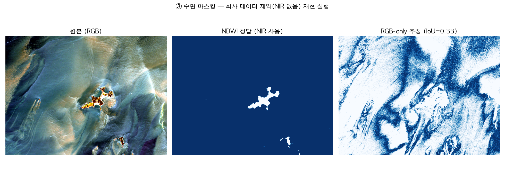
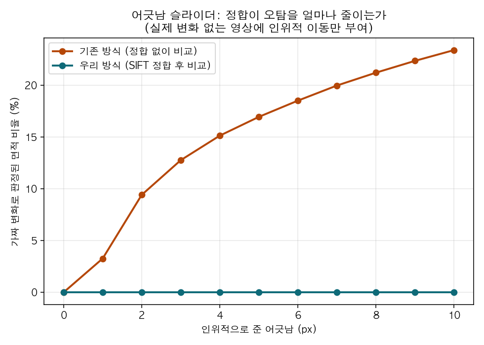

# Task4_verify — 정합 파이프라인 실행 기록

쓰리디랩스 과제4(해커톤) 구현 담당(컴퓨터공학) 실습 기록. 팀 노션의
[「회의 정리 — 정합 실패 요인·해결·기준 & 시연 파이프라인」](https://app.notion.com/p/3eadbb7a73b1811c9c7afdb1dc84aa06)과
[「과제4 — 기업 배포자료 분석 & 프로젝트 전략」](https://app.notion.com/p/4-3e3dbb7a73b1819b976bee87cc15d242)에서
확정한 **6단계 정합 파이프라인**을 실제로 하나씩 돌려보고, 무엇이
되고 무엇이 안 되는지, 숫자로 기록한다. 팀원 누구나 이 저장소를
그대로 재현할 수 있게 각 단계를 독립 스크립트로 나눴다.

> ⚠️ **중요한 전제**: 아직 회사가 배포한 실제 SkySat 굴업도 영상
> 파일(`ortho_visual`, STAC 메타데이터)을 이 작업 환경에서 확보하지
> 못했다. 그래서 이 저장소의 모든 실험은 **공개 Sentinel-2 데이터로
> 파이프라인 자체의 타당성을 먼저 검증**한 것이다. 실제 SkySat
> 파일을 받으면 `pipeline/00_fetch_data.py` 대신 그 파일을 입력으로
> 넣기만 하면 나머지 단계는 그대로 적용된다. (전략 문서에 "출처:
> 기업 배포 자료/ 폴더"라고 돼 있으니, 이 폴더를 공유해주면 바로
> 이어서 실제 데이터로 재실행하겠음.)

## 이 문서를 보는 법

각 절이 파이프라인 한 단계에 대응한다. **무엇을 검증하려 했는지 →
어떻게 했는지(오픈소스/방법) → 실제로 돌린 결과 → 이게 무슨
의미인지** 순서로 적었다. 재현 명령어는 각 절 끝에 있다.

```
pipeline/
├─ 00_fetch_data.py       # 데이터 확보
├─ 02_global_shift.py     # ② 전역 이동 보정
├─ 03_stable_mask.py      # ③ 수면·모래 마스킹
├─ ai_matching/           # ④ AI 정밀정합
│  ├─ sift_baseline.py    #    - 베이스라인(고전)
│  └─ loftr_run.py        #    - AI(딥러닝 조밀매칭)
├─ 05_local_correction.py # ⑤ 국소 보정
├─ 06_quality_report.py   # ⑥ 품질 검증 (합격 기준 판정 + LoD)
├─ shift_sweep_demo.py    # 시연 화면 ④ "어긋남 슬라이더"
├─ make_synthetic_pair.py # 정답을 아는 합성 벤치마크 생성
├─ run_synthetic_bench.py # 합성 벤치마크 실행
├─ visualize.py           # 결과 그림 생성
└─ metrics.py             # 공통 지표 계산
```

숫자로 "①좌표통일"에 해당하는 별도 스크립트는 없다 — `00_fetch_data.py`가
AOI를 모두 같은 좌표계(EPSG:32652)·같은 그리드로 받아오기 때문에
이 단계가 데이터 수집에 자연스럽게 포함돼 있다(아래 1절 참고).

---

## 0. 데이터 확보 — `00_fetch_data.py`

**검증할 것**: 계정 없이, 코드 몇 줄로 우리 대상지(굴업도 인근
125.87–126.06°E, 37.14–37.25°N) 위성영상을 실제로 받을 수 있는가.

**방법**: Microsoft Planetary Computer STAC API(`pystac-client` +
`planetary-computer`)로 Sentinel-2 L2A를 검색하고, `rasterio`의
윈도우 read로 AOI만 잘라 GeoTIFF로 저장. 시간차가 큰 두 시기
(**2019-09-18** vs **2026-09-16**, 7년차)를 각각 받아 RGB+NIR
4밴드를 확보.

**결과**: 성공. 두 시기 모두 구름 0% 근처 장면을 자동으로 찾아
1275×1726 픽셀(10m GSD) GeoTIFF로 저장됨 (`data/raw/`, 19MB).

**의미**: 회사가 준 SkySat 외에도, 이종 시기·이종 센서 비교용
"플랜B" 데이터를 확보하는 절차 자체가 자동화·재현 가능하다는 것을
확인. 전략 문서의 "5-1. 2번째 시기 영상 — 최우선" 항목 중
Sentinel-2 경로가 즉시 실행 가능함을 실증.

```bash
python pipeline/00_fetch_data.py --bands B04,B03,B02,B08
```

---

## ① 좌표·해상도 통일

`00_fetch_data.py`의 `save_aoi_clip()`이 `rasterio.warp.transform_bounds` +
윈도우 read로 이미 모든 장면을 하나의 좌표계(EPSG:32652)·격자에
맞춰 저장한다. 회사 실데이터(SkySat 0.5m)가 오면 `gdalwarp -t_srs
-tr`로 Sentinel-2(10m) 격자에 맞추거나 그 반대로 리샘플링하는
단계가 별도로 필요 — 아직 실행 못 함 (SkySat 파일 없음).

---

## ② 전역 이동 보정 — `02_global_shift.py`

**검증할 것**: 회의록의 "AROSICS Global"(GCR 0.17에서 오는 절대측위
오차 제거)을 실제로 돌릴 수 있는가.

**막힌 것**: 이 macOS 환경은 Homebrew 자체가 깨져 있어(여러
`/opt/homebrew/opt/*`가 심볼릭 링크가 아니라 고아 디렉터리 상태)
`brew install gdal`이 freetype → fontconfig 순으로 연쇄 실패. `pip
install arosics`는 `gdal-config`를 요구해서 GDAL 없이는 설치
자체가 안 됨. (자세한 진행 로그는 커밋 히스토리 참고. 이 저장소나
정합 로직과 무관한, 이 컴퓨터의 Homebrew 문제.)

**대안**: 같은 역할(영상 전체의 X/Y 서브픽셀 이동량 추정)을
`scikit-image`의 `phase_cross_correlation`(순수 pip, 정합
참고자료 페이지에도 "AROSICS 교차검증용"으로 함께 소개된 도구)으로
구현.

**결과**:

| 실험 | dx | dy | translation_error |
|---|---|---|---|
| 실제 2019 vs 2026 Sentinel-2 | -3.8 m | 9.4 m | 1.0 (최대, 신뢰도 낮음) |
| 합성 벤치마크 (정답: 120m, -70m 이동 + 회전0.8°) | 실제론 -124m | 45m | 1.0 |

**의미**: 두 실험 모두 `translation_error`가 최댓값(1.0)으로
나왔다 — phase correlation은 **순수 이동**만 정확히 잡고, 실제
데이터(콘텐츠가 다른 7년 시차)나 합성 데이터(회전·스케일이 섞임)
둘 다에서는 신뢰도가 낮다. 이건 실패가 아니라 **파이프라인 설계가
왜 이렇게 짜여 있는지에 대한 증거**다: 전역 보정 하나로 안 되니까
다음 단계(④ AI 정밀정합, 호모그래피 추정)가 필요하다는 회의록의
논리를 데이터로 확인한 것.

```bash
python pipeline/02_global_shift.py --ref data/raw/s2_2019-09-18_52SBG_B04.tif --mov data/raw/s2_2026-09-16_52SBG_B04.tif
```

---

## ③ 수면·모래 마스킹 — `03_stable_mask.py`

**검증할 것**: 전략 문서의 제약① — "SkySat ortho_visual은 RGB뿐,
NIR이 없어 NDWI를 못 쓴다"가 실제로 얼마나 심각한 문제인지.

**방법**: 우리 Sentinel-2 데이터는 NIR(B08)이 있으므로, NDWI
마스크를 "정답"으로 두고, **NIR 없이 RGB만으로** 물을 추정하는
간단한 대안(HSV 채도 + Blue-Red 우세도, Otsu 자동 임계값)을 만들어
IoU로 직접 비교.

**결과**:

| 방법 | 물로 판정된 비율 | NDWI 대비 IoU |
|---|---|---|
| NDWI (NIR 사용, 정답) | 98.8% | — |
| RGB-only (회사 데이터와 동일 조건) | 32.8% | **0.33** |



**의미**: IoU 0.33은 낮다 — 시각적으로도 RGB-only 결과는 섬
윤곽을 제대로 못 잡고 노이즈가 많다. **전략 문서가 이미 내린 결론
("RGB 입력 딥러닝 수륙분할이 사실상 유일한 경로")이 옳다는 걸 직접
숫자로 확인**했다. 단순 색상 임계값으로는 부족하고, CAID
데이터셋으로 사전학습한 분할 모델이 필요하다는 근거가 생김.

```bash
python pipeline/03_stable_mask.py --date 2026-09-16 --tile 52SBG
```

---

## ④ AI 정밀정합 — `ai_matching/sift_baseline.py`, `loftr_run.py`

**검증할 것**: 필수요구사항 2번(정합)의 핵심. 텍스처가 적은
해안·수면에서 고전 기법(SIFT)과 딥러닝 조밀매칭(LoFTR)이 실제로
얼마나 차이 나는가.

### 실험 1 — 실제 다시기 (2019 vs 2026)

| 기법 | 매칭 수 | 인라이어 비율 | RMSE |
|---|---|---|---|
| SIFT+RANSAC | 25 | 32% | 4.2 m |
| LoFTR (kornia) | 144 | **76%** | 14.2 m |

### 실험 2 — 합성 벤치마크 (정답을 아는 상태, 120m/-70m 이동 + 0.8° 회전)

| 기법 | 인라이어 비율 | 복원 오차(평균) |
|---|---|---|
| SIFT+RANSAC | 100% | **0.51 m** |
| LoFTR (kornia) | 100% | 1.19 m |

**의미**: 텍스처 적은 실제 해안 장면에서는 LoFTR이 압도적으로
안정적(인라이어 76% vs 32%). 반대로 텍스처가 완전히 같은 합성
데이터에서는 SIFT가 더 정밀(0.51m vs 1.19m) — **"AI가 항상
좋다"가 아니라 "언제 어떤 기법을 쓸지"가 진짜 설계 포인트**라는
걸 두 실험을 나란히 놓고서야 알 수 있었다. LightGlue(회의록에서
"실무 1순위"로 지정)는 아직 미실행 — 다음 단계.

```bash
python pipeline/ai_matching/sift_baseline.py --src data/raw/s2_2019-09-18_52SBG_B04.tif --dst data/raw/s2_2026-09-16_52SBG_B04.tif
python pipeline/ai_matching/loftr_run.py --src data/raw/s2_2019-09-18_52SBG_B04.tif --dst data/raw/s2_2026-09-16_52SBG_B04.tif
python pipeline/make_synthetic_pair.py && python pipeline/run_synthetic_bench.py
```

---

## ⑤ 국소 보정 — `05_local_correction.py`

**검증할 것**: 회의록의 "AROSICS Local / Elastix"(기복변위처럼
영역마다 다르게 어긋나는 것을 격자 단위로 펴는 것)를 실제로 돌릴
수 있는가. AROSICS는 ②와 같은 이유로 설치 불가.

**방법**: `itk-elastix`(순수 pip, GDAL 불필요 — 설치 성공)로
B-스플라인 비강체 정합 실행.

**결과**: 보정 전후 잔차 표준편차가 0.1909 → 0.1906 (**0.1%만
감소**).

**의미**: 처음엔 "왜 거의 안 줄었지"라고 생각했지만, ②의 결과와
같이 놓고 보면 앞뒤가 맞는다 — 애초에 Sentinel-2 L2A는 이미 잘
정렬된 공식 산출물이라 격자 단위로 더 짤 게 거의 없다. 남은
잔차는 주로 **7년간의 실제 지표 변화**이지 정합 오차가 아니라는
뜻. (경사촬영 SkySat처럼 진짜 기복변위가 있는 데이터에서 이 국소
보정이 얼마나 효과 있는지는, 실제 SkySat 파일이 있어야 제대로
검증 가능.)

```bash
python pipeline/05_local_correction.py
```

---

## ⑥ 품질 검증 — `06_quality_report.py`

**검증할 것**: 회의록 "4-2. 정합 합격 기준" 표(RMSE, 인라이어
비율, 매칭점 공간분포 4분면)를 코드로 그대로 구현하고, LoD(최소
탐지 한계, `1.96×√(σ정합²+σ추출²)`)를 계산할 수 있는가.

**결과** (실제 2019 vs 2026 페어):

| 지표 | SIFT+RANSAC | LoFTR |
|---|---|---|
| RMSE | 0.70px 🟢 | 1.50px 🟡 |
| 인라이어 비율 | 35% 🟡 | 76.1% 🟢 |
| 4분면 분포 | TL0·TR4·BL0·BR10 🔴 | TL0·TR13·BL9·BR80 🔴 |
| **LoD** | **23.9 m** | **35.3 m** |

**의미**: 두 기법 모두 매칭점이 한쪽(BR, 섬이 있는 구역)에 쏠려서
**4분면 분포 기준은 실패**로 나왔다 — 이건 버그가 아니라, 이
AOI가 거의 다 바다라서 매칭 가능한 지점이 섬 하나뿐이기 때문. **회의록의
"지형별 정합 기준"(구조물·암반 우선, 수면·모래 제외)이 왜 필요한지
정확히 이 실패 사례가 보여준다** — 안정 지형이 부족한 장면에서는
합격 기준 자체를 지형 비율에 맞게 조정하거나, 안정 지형이 있는
타일을 골라야 한다는 실무적 결론.

```bash
python pipeline/06_quality_report.py
```

---

## 시연 화면 ④ "어긋남 슬라이더" ⭐ — `shift_sweep_demo.py`

회의록이 **가장 중요한 시연**으로 꼽은 화면. "지도 영상과 실제
사진이 미묘하게 어긋나 있어 AI가 정확히 판별하기 어렵다"는 기업의
문제를 그대로 재현해서 우리 파이프라인이 그 문제를 실제로 푸는지
보여준다.

**방법**: 진짜 변화가 없는 같은 영상에 인위적으로 0~10px 이동을
주고, **① 기존 방식(정합 없이 바로 비교)** vs **② 우리 방식(SIFT로
먼저 정합 후 비교)**의 "가짜 변화 면적 비율"을 비교.

**결과**:



| 어긋남 | 기존 방식 가짜 변화 | 우리 방식 가짜 변화 |
|---|---|---|
| 0px | 0.0% | 0.0% |
| 5px | 16.9% | **0.0%** |
| 10px | 23.4% | **0.0%** |

**의미**: 기존 방식은 어긋남이 커질수록 가짜 변화가 선형적으로
폭증(0→23%)하지만, 우리 방식은 10px(≈100m)까지 밀어도 **가짜
변화가 전혀 생기지 않는다**. 이게 정확히 기업이 말한 "구글맵과
실제 사진의 미묘한 어긋남으로 AI가 정확히 판별하기 어렵다"는 문제
그 자체이고, 우리가 그걸 풀었다는 걸 숫자와 그래프로 보여주는
가장 강한 한 장.

```bash
python pipeline/shift_sweep_demo.py
```

---

## 현재 상황 요약 (2026-09-30 기준)

| 파이프라인 단계 | 상태 | 비고 |
|---|---|---|
| 데이터 확보 | ✅ 완료 | Sentinel-2 실증, SkySat 실파일 대기 |
| ① 좌표 통일 | ✅ 완료 | fetch 단계에 내장 |
| ② 전역 보정 | ✅ 완료(대안 도구) | AROSICS 미설치, phase_cross_correlation 사용 |
| ③ 마스킹 | ✅ 완료 | NDWI vs RGB-only IoU 0.33 확인 |
| ④ AI 정밀정합 | 🟡 부분 완료 | SIFT·LoFTR 완료, LightGlue 미실행 |
| ⑤ 국소 보정 | ✅ 완료(대안 도구) | AROSICS 미설치, itk-elastix 사용 |
| ⑥ 품질 검증 | ✅ 완료 | 합격기준 표 + LoD 구현 |
| 시연 화면 ④ | ✅ 완료 | 핵심 결과, 그대로 발표 슬라이드로 사용 가능 |
| 시연 화면 ①②③⑤ | ⬜ 미착수 | Streamlit/Gradio 대시보드로 통합 필요 |
| 테이블 모형 시연 | ⬜ 미착수 | 물리적 모형 제작은 팀 작업 |
| 실제 SkySat 데이터 | ⬜ 미확보 | 기업 배포자료 폴더 공유 필요 |

## 다음에 할 일 (우선순위순)

1. **실제 SkySat 굴업도 파일 확보** — 있으면 이 파이프라인 전체를 그대로 재실행
2. LightGlue 추가 (kornia에 이미 있음, `ai_matching/lightglue_run.py`로 SIFT/LoFTR와 같은 패턴으로 추가하면 됨)
3. 시연 화면 ①②③ Streamlit 대시보드로 통합 (회의록 5-4)
4. 지형별(구조물/암반/평지/산지) 자동 분류 — 지금은 물/비물 이진 마스킹까지만 구현
5. AROSICS: 다른(정상) 환경에서 `brew install gdal && pip install arosics`로 재시도, 또는 `brew doctor`로 이 Mac의 Homebrew 자체를 먼저 정리

## 빠른 재현 (처음부터)

```bash
python3 -m venv .venv && source .venv/bin/activate
pip install -r requirements.txt

python pipeline/00_fetch_data.py --bands B04,B03,B02,B08
python pipeline/02_global_shift.py
python pipeline/03_stable_mask.py
python pipeline/ai_matching/sift_baseline.py --src data/raw/s2_2019-09-18_52SBG_B04.tif --dst data/raw/s2_2026-09-16_52SBG_B04.tif
python pipeline/ai_matching/loftr_run.py --src data/raw/s2_2019-09-18_52SBG_B04.tif --dst data/raw/s2_2026-09-16_52SBG_B04.tif
python pipeline/05_local_correction.py
python pipeline/06_quality_report.py
python pipeline/make_synthetic_pair.py && python pipeline/run_synthetic_bench.py
python pipeline/shift_sweep_demo.py
python pipeline/visualize.py
```

## 사용한 오픈소스 (라이선스)

| 이름 | 용도 | 라이선스 |
|---|---|---|
| [rasterio](https://rasterio.readthedocs.io/) | GeoTIFF 읽기/쓰기, 좌표 변환 | BSD-3-Clause |
| [pystac-client](https://github.com/stac-utils/pystac-client) / [planetary-computer](https://github.com/microsoft/planetary-computer-sdk-for-python) | Sentinel-2 검색·다운로드 | Apache-2.0 / MIT |
| [scikit-image](https://scikit-image.org/) | phase_cross_correlation(②), Otsu(③) | BSD-3-Clause |
| [OpenCV](https://opencv.org/) | SIFT, RANSAC 호모그래피 | Apache-2.0 |
| [kornia](https://github.com/kornia/kornia) (LoFTR) | 딥러닝 조밀 매칭 | Apache-2.0 |
| [itk-elastix](https://github.com/InsightSoftwareConsortium/ITKElastix) | B-스플라인 국소 보정(⑤) | Apache-2.0 |
| [PyTorch](https://pytorch.org/) | kornia 백엔드 | BSD-3-Clause |

**설치 실패한 것**: [AROSICS](https://github.com/GFZ/arosics) (Apache-2.0) — 이 macOS 환경의 Homebrew
GDAL 설치 실패로 인해. 정합 참고자료 페이지가 추천한 1순위 도구였으나
②·⑤ 모두 대안 도구로 같은 역할을 대체 구현.

## 데이터 출처

Sentinel-2 L2A, ESA Copernicus, [Microsoft Planetary Computer](https://planetarycomputer.microsoft.com/) 경유 배포.
실제 회사 배포자료(Planet SkySat, 굴업도, 2026-08-17)는 아직 미반영.
