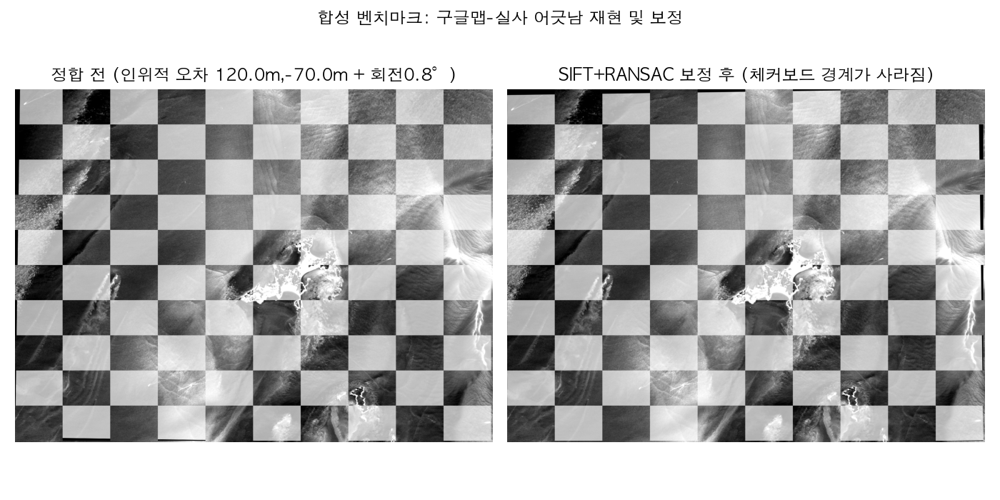

# Coastal Registration Bench

쓰리디랩스 과제4 — "여러 시간·센서에서 온 해안 영상을 얼마나 정확하게
정합할 수 있는가"를 검증하는 실험 저장소입니다. 최종 파이프라인이 아니라,
오픈소스 정합 기법들을 **실제 위성 데이터로 직접 돌려보고 비교한 기록**입니다.

## 왜 이 저장소인가

기업(3dlabs) 담당자 피드백: 위성영상을 매월 수집·처리하는데, 위치정보가
배경지도(구글맵)와 미묘하게 어긋나 정확한 판별이 어려움. 창의적인 확장
기능보다 **정합 정확도 자체의 기술적 완성도**가 우선순위.

이 저장소는 그 문제를 두 갈래로 검증합니다.

- **트랙 A**: 드론 영상(비디오)이 해안선 분석 도구가 쓰는 포맷(지오태깅
  JSON, GeoJSON)으로 문제없이 변환되는가
- **트랙 B**: 서로 다른 시간·센서에서 온 영상을 얼마나 정확히 정합할 수
  있는가 — 이번 실행의 핵심

## 지금까지 실제로 돌린 것 (트랙 B)

실제 드론 영상이 아직 없어서, 두 개의 실험으로 나눠 검증했습니다.

### 실험 1 — 실제 다시기 위성영상 (검증된 진짜 데이터)

Microsoft Planetary Computer에서 계정 없이 옹진 서해 도서 AOI
(125.87–126.06°E, 37.14–37.25°N)의 Sentinel-2 L2A 영상을 두 시기
(**2019-09-18** vs **2026-09-16**, 7년 차) 받아 그대로 정합했습니다.

| 기법 | 매칭 수 | 인라이어 | 인라이어 비율 | RMSE | 처리시간 |
|---|---|---|---|---|---|
| SIFT+RANSAC | 25 | 8 | 32% | 4.2m | 0.3s |
| LoFTR (kornia) | 144 | 110 | **76%** | 14.2m | 1.2s |

**해석**: 고전 기법(SIFT)은 텍스처가 적은 갯벌·수면이 많은 해안 장면에서
매칭 자체를 거의 못 찾습니다(25개 중 8개만 인라이어). Detector-free
dense 매칭(LoFTR)은 매칭 수와 인라이어 비율 모두 크게 앞섭니다 —
노션 선행조사에서 "텍스처 적은 모래·수면에 강함"이라고 예상했던 것이
실제 데이터로 확인됐습니다.

### 실험 2 — 합성 벤치마크 (정답을 아는 상태에서 정확도 측정)

실제 드론 영상이 없는 상태에서 "구글맵과 실사의 어긋남"을 정량적으로
재현하기 위해, 실제 Sentinel-2 영상 한 장에 **우리가 정확히 아는**
이동(120m, -70m) + 회전(0.8°) + 스케일(1.003) 오차를 인위적으로 주고,
각 기법이 이 오차를 얼마나 정확히 되찾아내는지 측정했습니다.

| 기법 | 매칭 수 | 인라이어 비율 | 복원 오차(평균) | 복원 오차(최대) |
|---|---|---|---|---|
| SIFT+RANSAC | 639 | 100% | **0.51m** | 0.71m |
| LoFTR (kornia) | 5,484 | 100% | 1.19m | 1.72m |

**해석**: 두 기법 모두 120m 크기의 인위적 위치 오차를 1~2m 수준까지
정확히 복원합니다. 같은 영상을 워핑만 한 경우(텍스처가 완전히 동일)라서
인라이어 비율이 100%로 실험 1과 대조적입니다 — **매칭 난이도는
"시간차(콘텐츠 변화)"에서 오지 "위치 오차 크기"에서 오지 않는다**는
것을 보여줍니다. 즉 구글맵과의 어긋남 자체보다, 계절·연도가 다른
영상끼리 정합하는 쪽이 훨씬 어려운 진짜 문제입니다.

결과 그림: [`results/figures/`](results/figures/)



## 빠르게 재현하기

```bash
python3 -m venv .venv && source .venv/bin/activate
pip install -r requirements.txt

# 1) 데이터 받기 (Planetary Computer, 계정 불필요)
python track_b_registration/fetch_sentinel2.py --bands B04,B03,B02,B08

# 2) 실제 다시기 정합
python track_b_registration/baselines/sift_baseline.py \
  --src data/raw/s2_2019-09-18_52SBG_B04.tif \
  --dst data/raw/s2_2026-09-16_52SBG_B04.tif
python track_b_registration/learned/loftr_run.py \
  --src data/raw/s2_2019-09-18_52SBG_B04.tif \
  --dst data/raw/s2_2026-09-16_52SBG_B04.tif

# 3) 합성 벤치마크 (정답 알고 있는 정량 검증)
python track_b_registration/make_synthetic_pair.py
python track_b_registration/run_synthetic_bench.py

# 4) 결과 그림 생성
python track_b_registration/visualize.py
```

## 아직 안 한 것 (다음 단계)

- **AROSICS**: 실행 환경(macOS)의 Homebrew 설치 자체가 깨져 있어(여러
  `/opt/homebrew/opt/*` 링크가 고아 상태) `brew install gdal`이
  freetype, fontconfig 등에서 연쇄적으로 실패. 이 저장소나 정합 로직과
  무관한 로컬 환경 문제라서, `brew doctor`로 Homebrew 자체를 먼저
  정리한 뒤 재시도가 필요. 다른(정상) 환경에서는
  `brew install gdal && pip install arosics`로 바로 될 가능성이 높음
- **트랙 A (영상→포맷 변환)**: 실제 드론 영상 확보 후 진행 예정
- **드론 정사영상 ↔ 위성 정합**: 드론 촬영 후 실행
- **GIM 현장 특화 재학습**: 드론 영상 확보가 선행 조건
- **브이월드 기준 절대오차 검증**: 고정 지물 좌표 채취 필요

## 폴더 구조

```
coastal-registration-bench/
├─ track_a_format/                # (예정) 영상 → JSON/GeoJSON 변환
├─ track_b_registration/
│  ├─ fetch_sentinel2.py          # Planetary Computer에서 AOI 클립 다운로드
│  ├─ make_synthetic_pair.py      # 정답을 아는 합성 벤치마크 생성
│  ├─ run_synthetic_bench.py      # 합성 벤치마크 실행+채점
│  ├─ visualize.py                # 결과 그림 생성
│  ├─ metrics.py                  # 공통 지표 계산
│  ├─ baselines/sift_baseline.py  # 고전 기법
│  └─ learned/loftr_run.py        # kornia LoFTR
├─ data/raw/                      # 실제 Sentinel-2 AOI 클립 (재현용, 19MB)
├─ data/interim/                  # 합성 벤치마크 산출물
├─ results/                       # 지표 JSON + 그림
└─ requirements.txt
```

## 사용한 오픈소스 (라이선스)

| 이름 | 용도 | 라이선스 |
|---|---|---|
| [rasterio](https://rasterio.readthedocs.io/) | GeoTIFF 읽기/쓰기 | BSD-3-Clause |
| [pystac-client](https://github.com/stac-utils/pystac-client) / [planetary-computer](https://github.com/microsoft/planetary-computer-sdk-for-python) | Sentinel-2 검색·다운로드 | Apache-2.0 / MIT |
| [OpenCV](https://opencv.org/) | SIFT, RANSAC 호모그래피 | Apache-2.0 |
| [kornia](https://github.com/kornia/kornia) (LoFTR) | 딥러닝 조밀 매칭 | Apache-2.0 |
| [PyTorch](https://pytorch.org/) | kornia 백엔드 | BSD-3-Clause |

## 데이터 출처

Sentinel-2 L2A, ESA Copernicus, [Microsoft Planetary Computer](https://planetarycomputer.microsoft.com/) 경유 배포.
